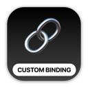
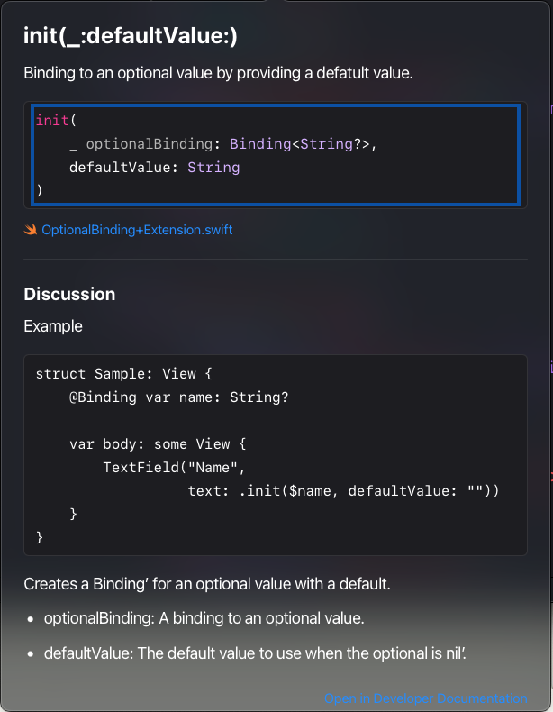

# Custom Bindings

 This is a new branch that has added an extension for Binding that makes using optionals much easier.

   

This removes the necessity to create your own custom binding for optionals and instead can use a different initializer.

The gist can be downloaded from:

https://gist.github.com/StewartLynch/8a4511d6f3525a55fcfe6fb005566f16

This is how you can use it

```swift
struct UsingBindingExtensionView: View {
    @State private var name: String?
    @State private var date: Date?
    
    var body: some View {
        VStack {
            TextField("Name", text: .init($name, defaultValue: ""))
            if date != nil {
                HStack {
                    DatePicker("Select Date", selection: .init($date, defaultValue: .now),
                displayedComponents: .date)
                    Button {
                        date = nil
                    } label: {
                        Image(systemName: "xmark.circle.fill")
                    }
                }
            } else {
                LabeledContent("Select Date") {
                    Button("Add Date") {
                        date = Date.now
                    }
                }
            }
        }
        .padding()
    }
}
```

If you want to support my work, you can - </br>

<a href='https://ko-fi.com/Z8Z22WRVG' target='_blank'></a>

